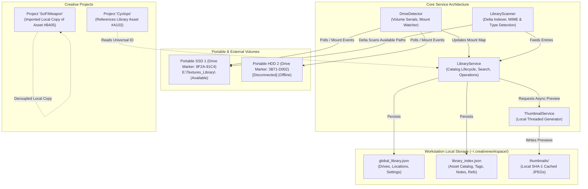
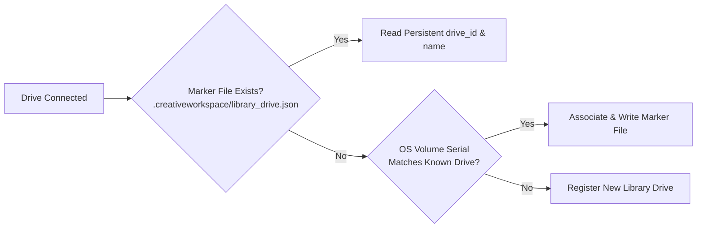
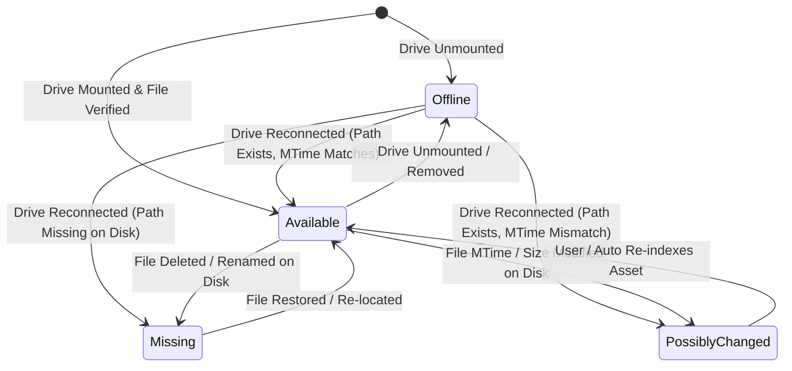
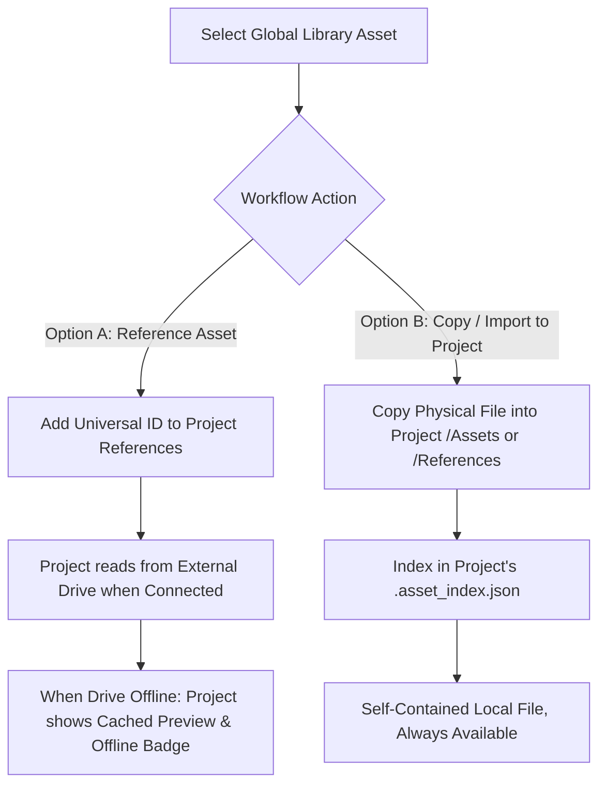
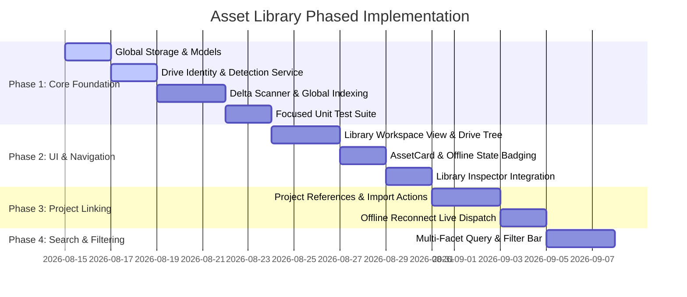

# CreativeWorkspace Global Asset Library Architecture

**Status:** Proposed / Architectural Specification  
**Version:** 1.0.0  
**Target Subsystem:** Global Asset Catalog & External Drive Indexing  
**Author:** DeepMind Pair Programming / CreativeWorkspace Core Team  

---

## 1. Executive Summary & Vision

In digital content creation (3D modeling, VFX, game development, motion design, and concept art), artists accumulate massive multi-terabyte libraries of textures, HDRIs, kitbash meshes, sound effects, scan data, and reference packages. These assets rarely fit on internal workstation drives and are routinely distributed across multiple external portable SSDs, HDDs, and network storage volumes.

**CreativeWorkspace Global Asset Library** transforms how artists interact with decentralized storage. It introduces a persistent, unified **Global Asset Catalog** that:
- Catalogs assets in-place on external drives without moving, copying, or duplicating original files.
- Persists full metadata, hierarchy, and visual thumbnails locally so assets remain discoverable, searchable, and inspectable even when the source drive is disconnected in a backpack or on a shelf.
- Automatically detects drive reconnection (regardless of Windows drive letter reassignments) and transitions assets from **Offline** to **Available** in real time.
- Enables projects to reference library assets non-destructively or explicitly import project-local copies on demand.

---

## 2. Goals & Non-Goals

### Goals
1. **Zero-Copy In-Place Cataloging**: Index folder hierarchies on external drives without altering or restructuring original assets.
2. **Drive-Agnostic Persistence**: Track physical storage volumes via persistent volume markers and hardware serials, ensuring immunity to dynamic Windows drive letter changes (`D:` → `E:` → `F:`).
3. **Offline Discovery & Visual Resilience**: Store high-quality visual thumbnails and complete metadata in the local workstation cache (`~/.creativeworkspace/library/`) so artists can browse and plan offline.
4. **Non-Destructive Project Referencing**: Allow creative projects to link to library assets by universal ID while preserving the option to create decoupled local copies.
5. **High-Performance Delta Indexing**: Rapidly scan nested folders by evaluating directory `mtime` and file headers, avoiding redundant reads of gigabyte-scale DCC files.
6. **Unified UI Integration**: Seamlessly extend the proven `AssetCard`, `FolderCard`, `InspectorPanel`, and `AssetInspectable` components into a dedicated global Library view.

### Non-Goals
1. **Automatic Cloud Sync / Backup**: The Asset Library is not a cloud sync daemon or file backup tool.
2. **Mandatory Full-Content Hashing**: Computing SHA-256 over terabytes of `.fbx`, `.exr`, `.blend`, and `.psd` files on initial scan is non-viable over USB 3.0/SATA interfaces and is strictly avoided for the default indexing pipeline.
3. **Destructive Auto-Reorganization**: The system will never automatically rename, sort, or relocate files on the user's external drives.
4. **Replacement of Project-Local Assets**: Project-local `Assets`, `References`, `Renders`, and `Exports` remain independent and fully functional.

---

## 3. System Architecture Diagram



---

## 4. Portable Drive Identity Model

Windows assigns drive letters (`D:`, `E:`, `F:`) dynamically based on connection order and other mounted devices. Relying on drive letters causes immediate catalog breakage when an external drive is plugged into a different USB port or when working across multiple machines.

### 4.1 Dual-Identity Strategy

CreativeWorkspace uses a resilient **Dual-Identity Mechanism**:



1. **Primary: In-Band Drive Marker File (`.creativeworkspace/library_drive.json`)**
   - Created on the root of any volume added as a library location.
   - Contains a unique UUID4 `drive_id`, user-friendly volume label, and creation timestamp.
   - Highly resilient across OS reinstalls, different workstations (Windows / macOS / Linux), and drive letter changes.
   ```json
   {
     "drive_id": "drv_e9a1843b-74df-4bc9-92db-8f81e3a9c721",
     "name": "Samsung T7 2TB - Kitbash & Textures",
     "created_at": "2026-08-14T18:00:00.000000",
     "format_version": 1
   }
   ```

2. **Secondary: Hardware/OS Volume Serial (Fallback & Auto-Detection)**
   - Captured via Windows Win32 API (`kernel32.GetVolumeInformationW`) or POSIX UUID.
   - Returns the 32-bit partition volume serial number (e.g., `A1B2-C3D4`).
   - If the volume marker file is missing or the drive is read-only, the catalog uses the volume serial to map to the cataloged drive.

### 4.2 Dynamic Mount Resolution

The `DriveDetector` maintains an active in-memory **Mount Map**:

| `drive_id` | Volume Label | Volume Serial | Current Mount Point | State |
| :--- | :--- | :--- | :--- | :--- |
| `drv_e9a1843b...` | Samsung T7 2TB | `8F2A-91C4` | `E:\` | `Available` |
| `drv_40bc21aa...` | WD Elements 4TB | `3B71-D002` | `None` | `Offline` |
| `drv_9182cafe...` | Workstation NVMe | `4410-18EE` | `C:\` | `Available` |

When an asset needs to be accessed on disk:
$$\text{Runtime Path} = \text{Mount Point}(\text{asset.drive\_id}) + \text{asset.drive\_relative\_path}$$

If `asset.drive_id` is currently unmounted (`Mount Point == None`), the asset is marked **Offline**, but its metadata, thumbnail, tags, and notes remain 100% accessible in the UI.

---

## 5. Library Locations & Scanning Strategy

A **Library Location** is a designated root folder on a specific storage volume (e.g., `E:\3D_Assets\Megascans\` or `F:\Textures\`).

### 5.1 Library Location Data Model

Stored in `~/.creativeworkspace/library/library_locations.json`:

```json
{
  "location_id": "loc_7b29a10f-54dc-4674-8b1e-f3f22c60811b",
  "drive_id": "drv_e9a1843b-74df-4bc9-92db-8f81e3a9c721",
  "display_name": "Megascans 3D Plants",
  "drive_relative_path": "3D_Assets/Megascans/Plants",
  "default_category": "Assets",
  "watch_for_changes": true,
  "last_scanned_at": "2026-08-14T17:30:00.000000",
  "scan_depth_limit": 10,
  "ignore_patterns": [".*", "__*", "node_modules", "*.tmp", "$RECYCLE.BIN"]
}
```

### 5.2 High-Performance Delta Scanning Strategy

Scanning large collections (100,000+ files) must be fast and non-blocking:

1. **Folder MTime Check**:
   - For each directory, compare the directory's last modified timestamp (`mtime`) with the stored catalog timestamp for that folder.
   - If directory `mtime` is unchanged and child count matches, skip rescanning all children inside that directory.
2. **Delta Reconciliation**:
   - Existing entries in catalog matching `(drive_id, drive_relative_path)` with identical `size` and `mtime` are retained without modifications.
   - Newly discovered files are ingested and queued for background thumbnail extraction.
   - Missing files previously in this folder are marked as `Missing` (if drive is online) or `Offline` (if drive is unmounted).
3. **Background Thumbnail Pipeline**:
   - Thumbnails are generated asynchronously via `QThreadPool` (max 2 concurrent threads to avoid USB bus saturation).
   - Generated JPEG previews are stored permanently in the workstation's local thumbnail directory:
     `~/.creativeworkspace/library/thumbnails/<sha1_hash>.jpg`
   - Thumbnails are retained locally even when external drives are disconnected.

---

## 6. Asset Identity Strategy & Content Hashing Tradeoffs

### 6.1 Catalog Asset Identity (Universal ID)

Every asset in the global catalog is assigned a permanent, unique UUID4 **Catalog ID** (e.g., `lib_90f2b3c4-11e2-4d5a-8b92-74d32098e6a1`).

An asset entry is defined as:
```json
{
  "id": "lib_90f2b3c4-11e2-4d5a-8b92-74d32098e6a1",
  "filename": "Nordic_Moss_01_LOD0.fbx",
  "drive_id": "drv_e9a1843b-74df-4bc9-92db-8f81e3a9c721",
  "location_id": "loc_7b29a10f-54dc-4674-8b1e-f3f22c60811b",
  "drive_relative_path": "3D_Assets/Megascans/Plants/Nordic_Moss_01/Nordic_Moss_01_LOD0.fbx",
  "file_size": 4829104,
  "file_mtime": 1723657200.0,
  "friendly_type": "FBX 3D Model",
  "category": "3D Models",
  "tags": ["foliage", "moss", "nature", "ground_cover"],
  "notes": "Includes 4K PBR textures in neighboring Textures/ folder.",
  "version": null,
  "lod": "LOD0",
  "resolution": null,
  "thumbnail_rel": "e9/a1/8f3a0928b9c2.jpg",
  "favorite": true,
  "created_at": "2026-08-14T17:30:00.000000",
  "updated_at": "2026-08-14T17:35:00.000000",
  "project_references": [
    {
      "project_location": "C:/Users/artist/CreativeWorkspace/Projects/ForestEnvironment",
      "project_name": "ForestEnvironment",
      "referenced_at": "2026-08-14T17:40:00.000000",
      "mode": "reference"
    }
  ]
}
```

### 6.2 Conflict & Edge Case Matrix

| Scenario | System Behavior | Rationale |
| :--- | :--- | :--- |
| **Same filename on different drives** | Both cataloged with unique `id`, distinguishable by `drive_id` and location badge in UI. | Artists often have different versions or unrelated assets sharing generic names (e.g. `Rock_01.fbx`). |
| **Drive letter changes (`D:` → `E:`)** | Auto-detected via `drive_id`. All asset paths dynamically resolve to new drive letter with zero catalog updates. | Seamless plug-and-play workflow. |
| **File moved within same library location** | Detected during rescan if size + mtime match an unlocated asset from that drive; updates `drive_relative_path` and preserves ID, tags, and notes. | Preserves user metadata (tags, notes, favorites) when organizing folders. |
| **File modified on disk** | `mtime` / `size` delta triggers re-indexing of metadata and thumbnail regeneration; preserves `id`, tags, notes, and project references. | Artists iterate on textures and models; metadata should not be wiped out. |
| **Duplicate identical files** | Each file entry maintains its own path and ID, but can display a "Duplicate asset detected" hint if requested. | Filesystem integrity is respected. |

### 6.3 Content Hashing: Tradeoff Analysis

| Metric | Full File Content Hashing (SHA-256) | Fast Structural Identity (Drive + RelPath + Size + MTime) |
| :--- | :--- | :--- |
| **Scan Speed (1 TB USB 3 Drive)** | ~45–90 minutes (100–150 MB/s continuous read) | **1.2 to 2.8 seconds** (Directory traversal only) |
| **I/O & Drive Wear** | Heavy continuous disk read; spins up mechanical drives and heats SSDs | **Near-zero I/O**; only directory tables read |
| **Large DCC File Handling** | Blocks UI/thread pool on 10 GB `.blend` or `.usd` caches | **Instantaneous** |
| **Collision Risk** | Theoretical $2^{-256}$ | Zero within structured path scope |
| **Recommendation** | **Rejected for standard cataloging.** (Optional on-demand action for exact deduplication analysis only). | **Adopted as primary standard identity strategy.** |

---

## 7. Availability State Machine

Assets can be in one of four clearly defined states:



### State Definitions & UI Presentation

| State | Condition | UI Visual Cue | Available Actions |
| :--- | :--- | :--- | :--- |
| **Available** 🟢 | Drive mounted + file exists on disk + `mtime`/`size` match catalog. | Normal full-color thumbnail, crisp badge. | Open, Reveal in Explorer, Copy to Project, Reference, Edit Tags/Notes. |
| **Offline** 🟡 | Drive is not currently mounted/connected. | 50% opacity thumbnail, yellow drive badge with drive name (e.g. `[Samsung T7 - Offline]`). | View Cached Info, Edit Tags/Notes, Search, Remove from Catalog. *(Open/Reveal disabled with tooltip explaining required drive).* |
| **Missing** 🔴 | Drive is mounted, but file is absent at recorded relative path. | Warning overlay badge `[Missing from Drive]`. | Locate File Manually, Remove from Catalog, Scan for Moved Assets. |
| **Possibly Changed** 🔵 | Drive mounted, file exists, but `mtime` or `size` differs from catalog. | Subtle sync icon `[Changed on Disk]`. | Refresh Metadata & Thumbnail, Keep Current. |

---

## 8. Project References vs. Local Imports

Artists require two distinct workflows when connecting a library asset to a project:



### 8.1 Mode A: Non-Destructive Reference (`mode: "reference"`)
- The project records a pointer in its `.creativeworkspace/references.json`:
  ```json
  {
    "reference_id": "ref_018274a",
    "catalog_asset_id": "lib_90f2b3c4-11e2-4d5a-8b92-74d32098e6a1",
    "target_section": "References",
    "added_at": "2026-08-14T17:40:00.000000"
  }
  ```
- **Zero disk duplication**: Conserves local workstation space.
- **Drive Reconnection Awareness**: When the project is opened, any referenced library assets automatically query `LibraryService.get_asset_availability()`. If the drive is connected, paths resolve directly to the external drive. If offline, the project displays the cached preview with an "External Drive Offline" badge.

### 8.2 Mode B: Project-Local Import (`mode: "copy"`)
- Physically copies the asset into the project's `Assets/` or `References/` folder.
- Fully decoupled: Even if the external drive is formatted or given to another studio, the project retains its own self-contained working copy.
- The global catalog records that the project imported this asset for audit and provenance tracking.

---

## 9. Search, Filter, & Inspection Foundation

The global library requires high-performance instant searching across tens of thousands of cataloged assets across all drives (online or offline).

### 9.1 Fast In-Memory Inverted Index & Query Filters

`LibraryService` maintains an in-memory index keyed for sub-millisecond filtering:

- **Full-Text Filter**: Case-insensitive substring and token matching across `filename`, `tags`, `notes`, `category`, and parent folder paths.
- **Facet Filters**:
  - **Drive**: Filter by specific physical drive (e.g. `All Drives`, `Samsung T7`, `WD Elements`).
  - **Availability**: `All`, `Online Only`, `Offline Only`.
  - **Format / Type**: `3D Models (.fbx, .glb, .blend)`, `Textures & HDRIs (.exr, .png, .hdr)`, `Image Sequences`, etc.
  - **Tag Chips**: Multi-select tag filtering with additive (`AND`/`OR`) matching.
  - **Project Usage**: `Referenced in Current Project`, `Unused Assets`.
  - **Date Range & File Size Range**: Slider/combo filters.

### 9.2 Extensibility for Semantic / AI Embeddings (Future-Proofing)

The catalog data model includes dedicated, optional fields for vector embeddings and auto-generated semantic descriptions:
```json
{
  "semantic_metadata": {
    "embedding_version": null,
    "feature_vector": null,
    "auto_tags": [],
    "visual_description": null
  }
}
```
*Note: AI feature generation will be built in future phases, but the data schema is guaranteed compatible.*

---

## 10. Existing Architecture Reuse & Coexistence

CreativeWorkspace already has a robust asset grid, inspector, and service layer. The Global Asset Library is designed to maximize reuse while maintaining clean architectural boundaries.

### 10.1 Reused Components (Shared Layer)

| Existing Component | Reusability Strategy |
| :--- | :--- |
| **`AssetCard`** (`ui/widgets/asset_card.py`) | **100% Reused**. Displays filename, type icon, thumbnail, version/LOD badges. Extended with a subtle drive badge and offline opacity styling. |
| **`FolderCard`** (`ui/widgets/folder_card.py`) | **100% Reused**. Enables nested directory navigation within Library Locations. |
| **`InspectorPanel`** (`ui/panels/inspector_panel.py`) | **100% Reused**. Consumes `LibraryAssetInspectable` through the universal `InspectableObject` protocol. |
| **`InspectableObject` / Adapters** (`core/inspectable_adapters.py`) | Extended with `LibraryAssetInspectable`, providing editable Tags, Notes, Drive status, and Reference lists. |
| **`ThumbnailService`** (`services/thumbnail_service.py`) | Reused to generate and cache thumbnails in global storage `~/.creativeworkspace/library/thumbnails/`. |
| **`AssetIntelligence`** (`core/asset_intelligence.py`) | Reused for automatic LOD (`LOD0`), version (`v02`), and image sequence detection across library folders. |

### 10.2 Component Separation

```
CreativeWorkspace Architecture
├── Project Domain (Local to each Project folder)
│   ├── models/project.py
│   ├── services/project_service.py
│   ├── services/asset_service.py (.asset_index.json)
│   └── ui/panels/asset_workspace_panel.py (Assets/References/Renders/Exports)
│
└── Global Library Domain (Workstation ~/.creativeworkspace/library/)
    ├── models/library_drive.py
    ├── models/library_location.py
    ├── models/library_asset.py
    ├── services/library_service.py
    ├── services/drive_detection_service.py
    └── ui/panels/library_workspace_panel.py (Global Catalog Navigation & Search)
```

---

## 11. Security, Safety, & Error Recovery

1. **Read-Only Ingestion**: The scanning pipeline opens all external files in strictly read-only mode (`rb`). It never writes temporary files into library folders on external drives (except the lightweight `.creativeworkspace/library_drive.json` marker when registering).
2. **Graceful Handling of Read-Only / Locked Drives**: If an external drive is write-protected (e.g. SD card lock switch or read-only network mount), the system falls back to volume serial identity without error.
3. **Atomic Catalog Writes**: All global indexes (`global_library.json`, `library_index.json`) are written via atomic file replacement (`tempfile` + `os.replace`) to prevent corruption during sudden workstation shutdowns or USB disconnects.
4. **Path Traversal Protection**: All stored relative paths are normalized and validated to prevent path traversal outside designated library roots.

---

## 12. Phased Implementation Roadmap



---

## 13. Recommended First Implementation Chunk (Chunk 1)

### Scope for Chunk 1: Global Storage, Drive Identity & Core Catalog Service
1. **Data Models** (`models/library_models.py`):
   - `LibraryDrive`: persistent UUID, volume serial, label, last seen mount.
   - `LibraryLocation`: root path, relative drive path, watch settings.
   - `LibraryAsset`: catalog ID, drive ID, relative path, metadata, tags, notes.
2. **Drive Detection Service** (`services/drive_detection_service.py`):
   - Win32 Volume serial & drive marker reader.
   - Dynamic mount mapper (`resolve_path(drive_id, rel_path) -> Path | None`).
3. **Library Catalog Service** (`services/library_service.py`):
   - Persistence under `~/.creativeworkspace/library/`.
   - Add/Remove Library Location.
   - In-place directory indexing & delta update.
   - Unit tests covering drive letter reassignments, offline asset discovery, and metadata persistence.
